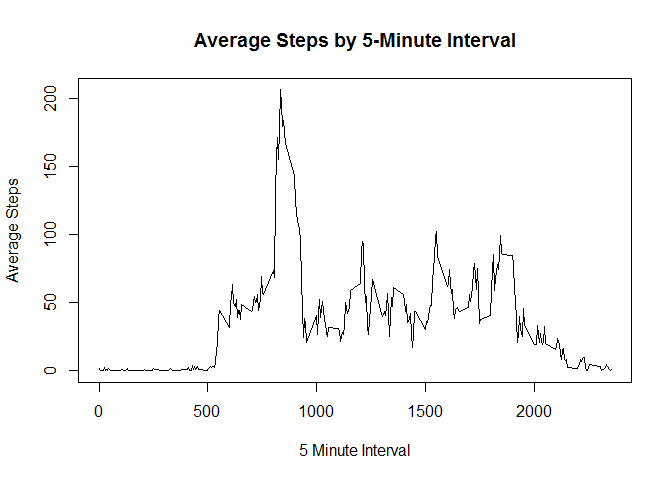

# Reproducible Research: Peer Assessment 1


## Loading and preprocessing the data
After the forking the repository on Github and cloning it to a local directory, the data for the study is found in a zip file in the cloned directory.  The initial steps are to:  
- unzip the file  
- create a data object from the file to use for answering the questions  

```r
unzip("c:\\Users\\RS150000\\Documents\\GitHub\\RepData_PeerAssessment1\\activity.zip"
      ,exdir = "c:\\Users\\RS150000\\Documents\\GitHub\\RepData_PeerAssessment1")
steps <- read.csv("c:\\Users\\RS150000\\Documents\\GitHub\\RepData_PeerAssessment1\\activity.csv", header=TRUE)
```
The read.csv function is used to create the data frame, "steps".  After the initial prep, the assignment asks questions in four sections of sets. The first section focuses on totals and distributions.

## What is mean total number of steps taken per day?
The first question asks for the total steps by day, which means that the result set will be fairly lengthy.

```r
by(steps$steps, steps$date, sum, na.rm = TRUE)
```

```
## steps$date: 2012-10-01
## [1] 0
## -------------------------------------------------------- 
## steps$date: 2012-10-02
## [1] 126
## -------------------------------------------------------- 
## steps$date: 2012-10-03
## [1] 11352
## -------------------------------------------------------- 
## steps$date: 2012-10-04
## [1] 12116
## -------------------------------------------------------- 
## steps$date: 2012-10-05
## [1] 13294
## -------------------------------------------------------- 
## steps$date: 2012-10-06
## [1] 15420
## -------------------------------------------------------- 
## steps$date: 2012-10-07
## [1] 11015
## -------------------------------------------------------- 
## steps$date: 2012-10-08
## [1] 0
## -------------------------------------------------------- 
## steps$date: 2012-10-09
## [1] 12811
## -------------------------------------------------------- 
## steps$date: 2012-10-10
## [1] 9900
## -------------------------------------------------------- 
## steps$date: 2012-10-11
## [1] 10304
## -------------------------------------------------------- 
## steps$date: 2012-10-12
## [1] 17382
## -------------------------------------------------------- 
## steps$date: 2012-10-13
## [1] 12426
## -------------------------------------------------------- 
## steps$date: 2012-10-14
## [1] 15098
## -------------------------------------------------------- 
## steps$date: 2012-10-15
## [1] 10139
## -------------------------------------------------------- 
## steps$date: 2012-10-16
## [1] 15084
## -------------------------------------------------------- 
## steps$date: 2012-10-17
## [1] 13452
## -------------------------------------------------------- 
## steps$date: 2012-10-18
## [1] 10056
## -------------------------------------------------------- 
## steps$date: 2012-10-19
## [1] 11829
## -------------------------------------------------------- 
## steps$date: 2012-10-20
## [1] 10395
## -------------------------------------------------------- 
## steps$date: 2012-10-21
## [1] 8821
## -------------------------------------------------------- 
## steps$date: 2012-10-22
## [1] 13460
## -------------------------------------------------------- 
## steps$date: 2012-10-23
## [1] 8918
## -------------------------------------------------------- 
## steps$date: 2012-10-24
## [1] 8355
## -------------------------------------------------------- 
## steps$date: 2012-10-25
## [1] 2492
## -------------------------------------------------------- 
## steps$date: 2012-10-26
## [1] 6778
## -------------------------------------------------------- 
## steps$date: 2012-10-27
## [1] 10119
## -------------------------------------------------------- 
## steps$date: 2012-10-28
## [1] 11458
## -------------------------------------------------------- 
## steps$date: 2012-10-29
## [1] 5018
## -------------------------------------------------------- 
## steps$date: 2012-10-30
## [1] 9819
## -------------------------------------------------------- 
## steps$date: 2012-10-31
## [1] 15414
## -------------------------------------------------------- 
## steps$date: 2012-11-01
## [1] 0
## -------------------------------------------------------- 
## steps$date: 2012-11-02
## [1] 10600
## -------------------------------------------------------- 
## steps$date: 2012-11-03
## [1] 10571
## -------------------------------------------------------- 
## steps$date: 2012-11-04
## [1] 0
## -------------------------------------------------------- 
## steps$date: 2012-11-05
## [1] 10439
## -------------------------------------------------------- 
## steps$date: 2012-11-06
## [1] 8334
## -------------------------------------------------------- 
## steps$date: 2012-11-07
## [1] 12883
## -------------------------------------------------------- 
## steps$date: 2012-11-08
## [1] 3219
## -------------------------------------------------------- 
## steps$date: 2012-11-09
## [1] 0
## -------------------------------------------------------- 
## steps$date: 2012-11-10
## [1] 0
## -------------------------------------------------------- 
## steps$date: 2012-11-11
## [1] 12608
## -------------------------------------------------------- 
## steps$date: 2012-11-12
## [1] 10765
## -------------------------------------------------------- 
## steps$date: 2012-11-13
## [1] 7336
## -------------------------------------------------------- 
## steps$date: 2012-11-14
## [1] 0
## -------------------------------------------------------- 
## steps$date: 2012-11-15
## [1] 41
## -------------------------------------------------------- 
## steps$date: 2012-11-16
## [1] 5441
## -------------------------------------------------------- 
## steps$date: 2012-11-17
## [1] 14339
## -------------------------------------------------------- 
## steps$date: 2012-11-18
## [1] 15110
## -------------------------------------------------------- 
## steps$date: 2012-11-19
## [1] 8841
## -------------------------------------------------------- 
## steps$date: 2012-11-20
## [1] 4472
## -------------------------------------------------------- 
## steps$date: 2012-11-21
## [1] 12787
## -------------------------------------------------------- 
## steps$date: 2012-11-22
## [1] 20427
## -------------------------------------------------------- 
## steps$date: 2012-11-23
## [1] 21194
## -------------------------------------------------------- 
## steps$date: 2012-11-24
## [1] 14478
## -------------------------------------------------------- 
## steps$date: 2012-11-25
## [1] 11834
## -------------------------------------------------------- 
## steps$date: 2012-11-26
## [1] 11162
## -------------------------------------------------------- 
## steps$date: 2012-11-27
## [1] 13646
## -------------------------------------------------------- 
## steps$date: 2012-11-28
## [1] 10183
## -------------------------------------------------------- 
## steps$date: 2012-11-29
## [1] 7047
## -------------------------------------------------------- 
## steps$date: 2012-11-30
## [1] 0
```
The second question asks for a consolidation of the total steps per day into a histogram.

```r
hist(by(steps$steps, steps$date, sum, na.rm = TRUE), breaks = 10, plot = TRUE
     , main = "Histogram of Total Steps by Day", xlab = "Steps per Day")
```

 
And then asks for the mean and median steps per day

```r
mean(by(steps$steps, steps$date, sum, na.rm = TRUE))
```

```
## [1] 9354.23
```

```r
median(by(steps$steps, steps$date, sum, na.rm = TRUE))
```

```
## 2012-10-20 
##      10395
```
The histogram's spike at the 10K step mark, the skew toward the high end, and the median of 10,395 may indicate that the subject had a daily target of 10k steps, a common suggested milestone for people tracking their steps.

The second section asks to look at the average daily activity pattern and identify the interval with the highest average activity
## What is the average daily activity pattern?

```r
library(dplyr)
```

```
## 
## Attaching package: 'dplyr'
## 
## The following objects are masked from 'package:stats':
## 
##     filter, lag
## 
## The following objects are masked from 'package:base':
## 
##     intersect, setdiff, setequal, union
```

```r
stepplot <- steps %>%
        group_by(interval) %>%
        summarize(mean(steps,na.rm = TRUE))
names(stepplot) <- c("interval","avg_steps")
plot(stepplot$interval, stepplot$avg_steps, type = "l"
     , main = "Average Steps by 5-Minute Interval", xlab = "5 Minute Interval", ylab = "Average Steps")
```

 

```r
filter(stepplot, avg_steps == max(avg_steps))
```

```
## Source: local data frame [1 x 2]
## 
##   interval avg_steps
## 1      835  206.1698
```
A quick view of the line chart displays peak activity in the morning before 10. The maximum average interval at 835 with 206 steps, narrows down our maximum activity range, putting the peak range roughly between 8 and 9.

The third section asks that missing values to be imputed and then the effect of the imputation to be reported.
## Imputing missing values

```r
summary(steps$steps)
```

```
##    Min. 1st Qu.  Median    Mean 3rd Qu.    Max.    NA's 
##    0.00    0.00    0.00   37.38   12.00  806.00    2304
```
Rather than simply replace the 2304 missing values with zeroes, the average steps for each interval would be rounded and substituted for each NA. Many of those averages will round down to zero for the overnight intervals, while NAs from daytime intervals having higher average activity will be filled in with hopefully more representative numbers. The new data set is called steps_nona and has the same structure as the first steps data frame created earlier.

```r
steps_mut <- inner_join(steps,mutate(stepplot, new_steps = round(avg_steps,0)), by = NULL)
```

```
## Joining by: "interval"
```

```r
steps_nona <- data_frame()
for(i in 1:17568) {
        if( is.na(steps_mut[i, 1]) ) {
                nasub <- as.data.frame(steps_mut[i, c(5,2,3)])
                names(nasub) <- c("steps", "date", "interval")
                steps_nona <- rbind(steps_nona, nasub)
        }
        else {
                orig <- as.data.frame(steps_mut[i,1:3])
                names(orig) <- c("steps", "date", "interval")
                steps_nona <- rbind(steps_nona, orig)
        }
}
hist(by(steps_nona$steps, steps_nona$date, sum, na.rm = TRUE), breaks = 10, plot = TRUE
     , main = "Histogram of Total Steps by Day (Imputed NAs)", xlab = "Steps per Day")
```

 
The histogram of steps_nona total steps per day looks substantially different than the original histogram.  A much larger number of days passed the 10K step milestone.

```r
summary(by(steps_nona$steps, steps_nona$date, sum, na.rm = TRUE))
```

```
##    Min. 1st Qu.  Median    Mean 3rd Qu.    Max. 
##      41    9819   10760   10770   12810   21190
```

```r
summary(by(steps$steps, steps$date, sum, na.rm = TRUE))
```

```
##    Min. 1st Qu.  Median    Mean 3rd Qu.    Max. 
##       0    6778   10400    9354   12810   21190
```
Imputing values for NAs increased both the median and mean daily step values between the NA data set and non NA data set, but did not change the values for either the 3rd quartile or the max.

The last assignment section is looking for differences in activity patterns between weekdays and weekends. Plotting those differences first requires the creation of a factor variable with levels for weekday and weekend.
## Are there differences in activity patterns between weekdays and weekends?

```r
steps_dayname <- mutate(steps_nona, dayname = weekdays(as.Date(date)))
steps_weekpart <- inner_join(steps_dayname
                             , data.frame( dayname = c('Monday','Tuesday','Wednesday','Thursday','Friday','Saturday','Sunday')
                                         , daytype = c('Weekday','Weekday','Weekday','Weekday','Weekday','Weekend','Weekend') ), by = NULL)
```

```
## Joining by: "dayname"
```

```
## Warning in inner_join_impl(x, y, by$x, by$y): joining character vector and
## factor, coercing into character vector
```

```r
str(steps_weekpart)
```

```
## 'data.frame':	17568 obs. of  5 variables:
##  $ steps   : num  2 0 0 0 0 2 1 1 0 1 ...
##  $ date    : Factor w/ 61 levels "2012-10-01","2012-10-02",..: 1 1 1 1 1 1 1 1 1 1 ...
##  $ interval: int  0 5 10 15 20 25 30 35 40 45 ...
##  $ dayname : chr  "Monday" "Monday" "Monday" "Monday" ...
##  $ daytype : Factor w/ 2 levels "Weekday","Weekend": 1 1 1 1 1 1 1 1 1 1 ...
```
After the day type factor is created, the panel plot can get generated.

```r
stepplot2 <- steps_weekpart %>%
        group_by(interval,daytype) %>%
        summarize(mean(steps,na.rm = TRUE))
names(stepplot2) <- c("interval","daytype","avg_steps")
library(lattice)
xyplot(avg_steps~interval|daytype, data = stepplot2, type="l", layout = c(1,2)
       , main = "Avg Steps per Interval by Week Part")
```

 
The plot clearly shows that weekdays concentrate most activity in the mornings, while weekend activity is spread out more through the day.  A result to be expected if the subject enjoys a regular work week.


